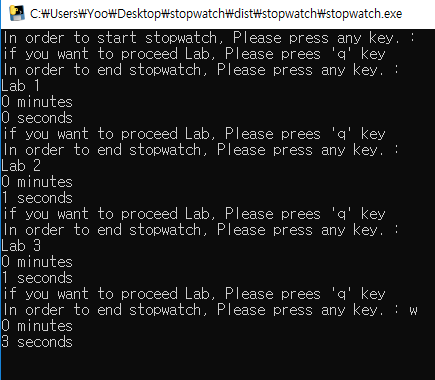

# StopWatch
> This is simply stopwatch.

Time spent is measured using python.

## Usage example

This is start message. Please  press any key and 'enter' key!

> input("시작하기 위해서 아무키나 입력하세요")
> now = time.gmtime(time.time())

This is end message. Please press any key and 'enter' key!

>input("끝내기 위해서 아무키나 입력하세요")
>last = time.gmtime(time.time())

Finally, press any key and 'enter' key, so the program will end.

## Release History

* 0.1.0
	* The first proper release
* 0.0.1
    * Work in progress

## Meta

Yoo Hyeong Jun – [@youjyeong6](https://www.instagram.com/youhyeong6) –

 jhdf1234@naver.com

## Contributing

1. Fork it (<https://github.com/yourname/yourproject/fork>)
2. Create your feature branch (`git checkout -b feature/fooBar`)
3. Commit your changes (`git commit -am 'Add some fooBar'`)
4. Push to the branch (`git push origin feature/fooBar`)
5. Create a new Pull Request
